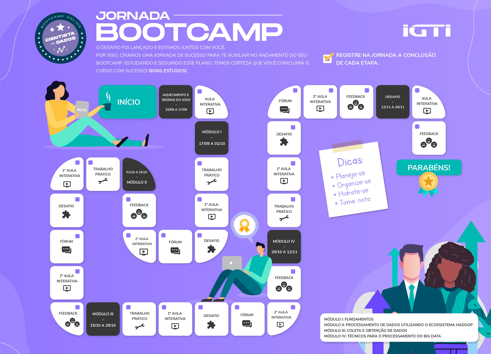

# Data Scientist Bootcamp 
#### IGTI

---
This repository is dedicated to all activities done during the Data Scientist Bootcamp promoted by IGTI - Institute of Management and Information Technology - Brazil.
https://www.igti.com.br/custom/bootcamp-cientista-de-dados/
The entire bootcamp is in Brazilian Portuguese, but the activities here are presented in English.

---

### Status
Under development.

---

### Bootcamp Roadmap

--- 

### Modules and Duration
The bootcamp consists of 148 hours (from Sept 2020 to Nov 2020) divided into 5 modules:
- [x] **Module 1** - Fundamentals of Data Science.
- [x] **Module 2** - Data Collection (Web Crawling and Web API).
- [x] **Module 3** - Data Processing using Hadoop.
- [x] **Module 4** - Big Data Processing.
- [x] **Module 5** - Final Challenge.

---

### Activities
All modules are composed by online classes and activities to reinforce the student's knowledge. The activities are:
- [x] **Practical Work** - A activity that uses applications and tools as a way to pratice the teorical content.
- [x] **Challenge** - A special activity that defies the student to seek answers while improving the knowledge received during classes.

---
